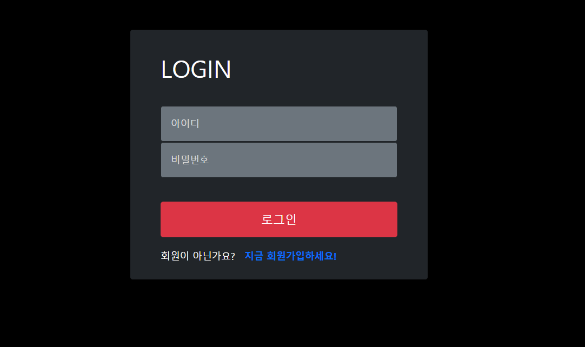
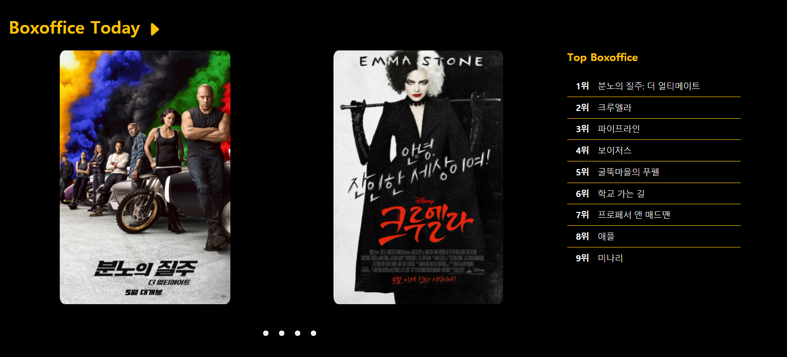
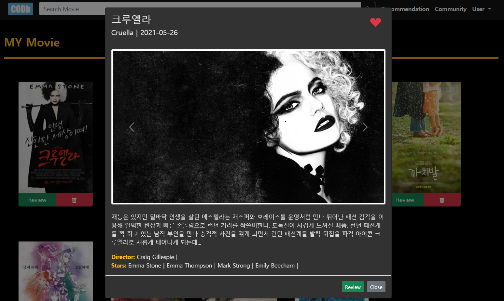
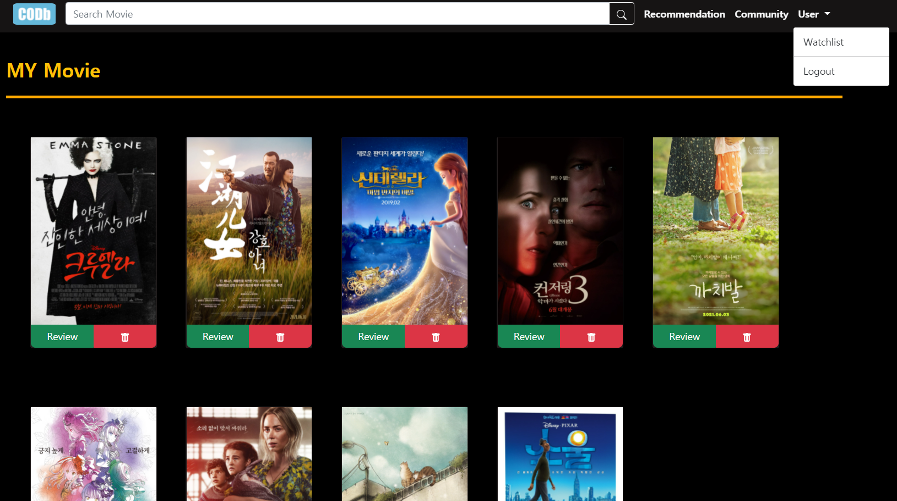
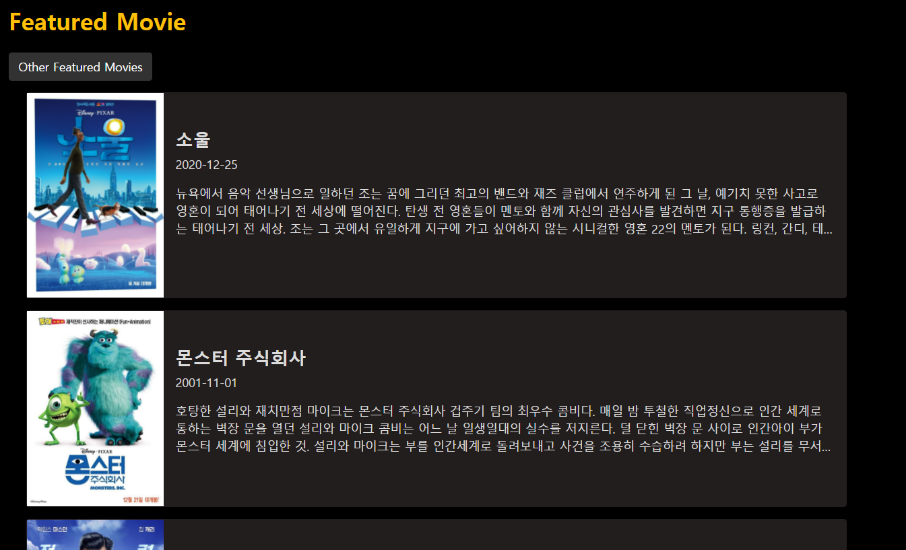
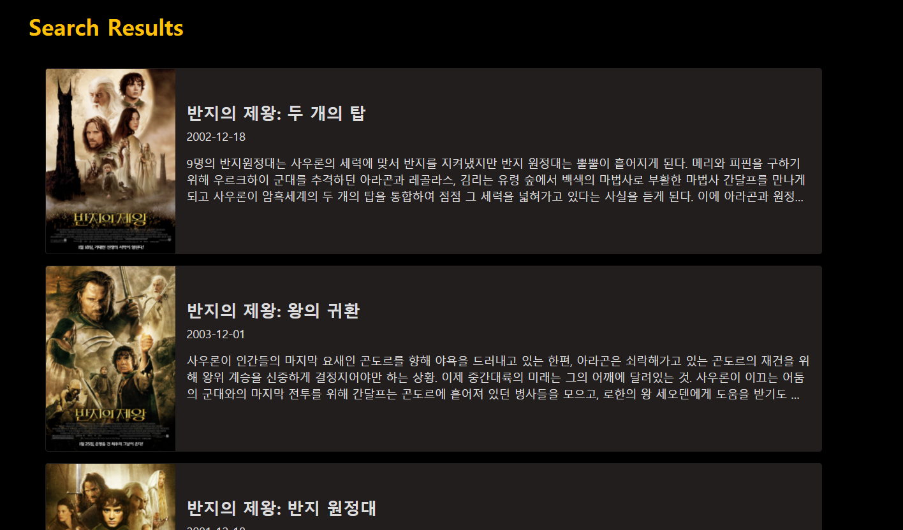
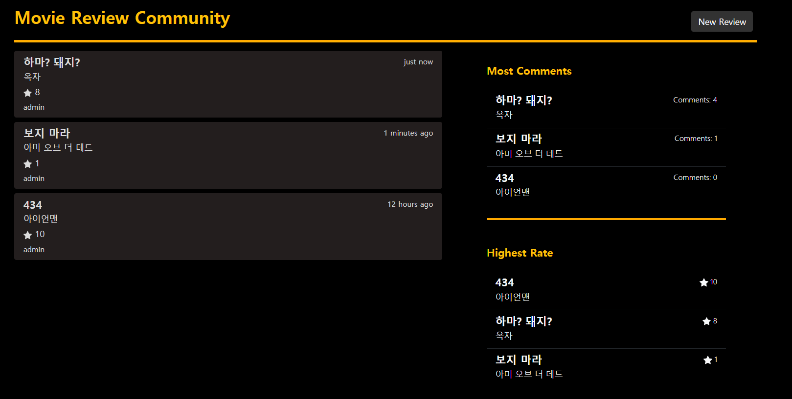

# Final-pjt. 영화 검색, 추천, 리뷰 사이트 - "COMD"

> SSAFY 1학기 마지막 프로젝트

## 팀원 및 역할 분담

팀원 : 오승철, 천주용

공통

- 아이디어 도출 및 기획
- 전반적인 백엔드/프론트엔드

오승철

- 회의록 작성

- Community, Recommendation 기능 구현

- TMDB API 활용 upcoming movies 구현

  

천주용

- Login, Watchlist 기능 구현
- Kofic, TMDB 활용 boxoffice today 구현

## 목표 서비스 구현 및 실제 구현 정도

- 회원 관리 기능 구현
  - [x] 회원 가입
  - [x] 로그인 / 로그아웃
  - [ ] 팔로우 기능 
- Home 페이지
  - [x] 일일 영화 순위
  - [x] 해당 영화 Carousel 구현
  - [x] 개봉 예정작 제공
- 영화 추천
  - [x] 좋아요 기반 추천
  - [x] 좋아요 없으면 고를 수 있도록 영화 리스트 제공
- 영화 검색
  - [x] 입력값 기반으로 영화 리스트 제공
  - [x] 클릭 시 영화 상세 정보 제공

- Community 구현
  - [x] 리뷰 CRUD
  - [x] 댓글 기능
  - [x] 평점 작성 가능
  - [ ] 리뷰 "좋아요" 기능
- Watchlist 구현
  - [x] "좋아요" 클릭한 영화들 보기
  - [x] 삭제 기능
  - [x] 리뷰 작성 버튼
- 영화 상세 정보
  - [x] Modal로 구현
  - [x] 좋아요 버튼 + 아이콘
  - [x] 리뷰 작성 및 닫기

## 데이터베이스 모델링(ERD)

- 

## 필수 기능에 대한 설명

- 로그인 / 로그아웃 / 회원가입

  

- Boxoffic Today & Top Boxoffice

  

  KOFIC API를 활용해서 일일 박스오피스 영화 제목을 얻음

  TMDB API를 활용해서 영화 제목을 검색하고 영화 데이터를 가져옴

  영화 데이터를 사용해서 원하는 방식으로 구현

- Upcoming movies

  

  TMDB API를 활용해서 개봉 예정작인 영화 데이터를 가져옴

  이후 원하는 방식으로 구현

- 영화 상세 정보

  

  포스터를 클릭하면 Modal로 볼 수 있게 구현

  "좋아요" 아이콘을 사용해서 좋아요 기능 구현

  Review 클릭 시, Review 작성 페이지로 이동 가능

- Watchlist

  

  유저가 좋아요 누른 영화를 볼 수 있는 페이지

  유저가 좋아요를 누르면 해당 정보가 서버에 저장되고 이 페이지로 유저가 접근하면 영화 정보들을 서버로부터 받아서 보여줌

  페이지에서 영화 삭제 및 리뷰 작성 가능

- 영화 추천

  

  유저가 좋아요 누른 영화의 장르 및 키워드를 바탕으로 영화 추천

  "Other Featured Movies" 클릭 시 다른 추천 영화들을 볼 수 있도록 구현

- 영화 검색

  

  입력값을 바탕으로 검색된 영화들을 보여줌

- Community

  

  리뷰 CRUD 및 댓글 기능

## 느낀점

- GitHub과 함께 하는 협업

  - GitHub을 사용해서 자료를 공유했는데 중간중간에 merge 하는 과정, pull 받는 과정에서 오류가 생길 때가 있었다.

    이런 문제가 생길 때마다 시간이 소요됐고, merge나 pull하는 게 익숙하지 않아서 어떻게 하는 지 찾아본다고 시간이 걸렸다.

    이후에 할 프로젝트들을 대비해서 GitHub를 알아놔야할 필요성을 느꼈다.

- 어떻게 구현할 지 구체적으로 미리 생각하기

  - 기능을 구현하기 전에 청사진은 그리고 시작했지만 구체적이지 않아서 힘들었던 적이 많았다.

    예를 들어, "좋아요"한 영화를 보여주는 Watchlist 구현할 때 삭제 버튼에 대한 계획은 없었다.

    그래서 영화 리스트만 서버에서 보내주는 형식으로 만들었다.

    그러다 보니 영화 하나를 목록에서 삭제하면 영화 리스트 전체를 다시 로드해와야하는 비효율적인 방식으로 삭제 기능을 구현해야 했다.

    시간적 여유가 있다면 원하는대로 구현할 수 있겠지만 생각보다 시간적 여유가 없어서 어쩔 수 없이 비효율적으로

    구현한 부분들이 있어서 아쉬웠다.

- CSS가 너무 어렵다

  - 정말 너무 어렵습니다.

- 하면 할수록 보이는 개선점들

  - 구현을 하면 할수록 개선점들이 보이는 게 신기했다.

    시간은 가고, 눈에 밟히는 애들은 늘어나고... 처음 시작할 때는 생각보다 금방 할 줄 알았는데,

    버튼 하나에 몇 시간을 쓰게 될 줄은 몰랐다.

- 부족한 시간

  - 분명 계획을 할 때는 마지막날은 여유롭게 일찍 끝나야 했다.

    하지만 프로젝트를 하다보니 예상치 못한 부분에서 에러가 나고 시간이 많이 걸렸다.

    생각보다 더 여유있게 계획을 짜야함을 깨달았다. 

