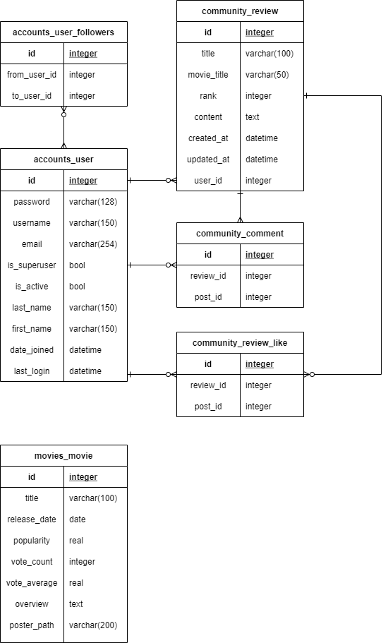

# 프로젝트 회의록

 

## 0518

- 프로젝트 주요 서비스
  - 독립영화를 추천하고 관련한 커뮤니티 페이지
    - 특정 장르/주제에 대한 영화를 다루는 서비스?
  - 최초 가입시 영화 추천을 위한 과정
    - 왓챠, 넷플릭스 등을 모방하여 추천 서비스 구현?

 

- 수집 가능한 영화 API
  - ~~[IMDb_API](https://rapidapi.com/blog/lp/imdb-api/?utm_source=google&utm_medium=cpc&utm_campaign=Alpha&utm_term=imdb%20api_e&gclid=CjwKCAjwqIiFBhAHEiwANg9szqD5GmH05iuHTH7T-xgejEhZ8qqqVd7iuYUd098iQvI2J75S8-gv1xoC7aAQAvD_BwE)~~
  - ~~[네이버 영화 API](https://developers.naver.com/docs/search/movie/)~~
  - [KMDb](https://www.kmdb.or.kr/info/api/apiDetail/6#)
  - [영화진흥위원회 kofic](https://www.kobis.or.kr/kobisopenapi/homepg/apiservice/searchServiceInfo.do)

 

- 필수 기능
  - 로그인 구현
    - 추가적으로 OAuth (구글, 페이스북, 카카오 로그인 연동)
  - 영화
    - Read 기능만
  - 커뮤니티
    - 리뷰 글 CRUD
    - 댓글 CRUD

 

- 추가 기능
  - 취향에 맞는 추천 서비스
    - 추천 알고리즘 아직 미정
  - ...

 

- 템플릿 참고 사이트
  - [IMDb](https://www.imdb.com/)
    - 네브바, 캐로젤, 영화관련 이슈(개봉작, 역주행작 등)

 

- GitHub Organization으로 관리

 

- 기본 모델링 구성

